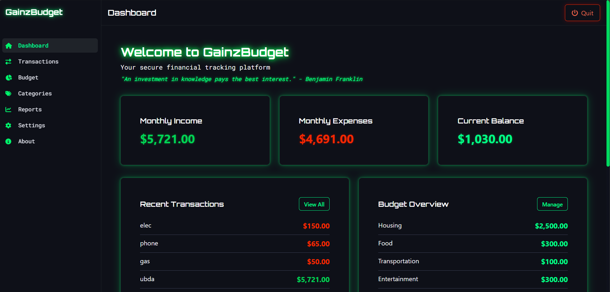

# GainzBudget

GainzBudget is a privacy-focused personal finance tracking application with an immersive, futuristic UI that runs entirely in your browser. Your financial data never leaves your device - it's stored locally using IndexedDB.



## Features

- **Immersive UI**: Enjoy a futuristic, 3D-like interface with glowing elements and dynamic animations
- **Dashboard**: Get a quick overview of your financial status with visually striking charts and stats
- **Transaction Management**: Track income and expenses with categories
- **Budget Planning**: Set and monitor budgets for different expense categories
- **Category Management**: Customize expense and income categories
- **Reports**: Analyze your spending patterns
- **Privacy-Focused**: All data stored locally on your device
- **Dark Mode**: Sleek dark theme with high contrast text for better readability
- **Intro Animation**: Engaging welcome screen with skippable animation


## Technologies Used

- [Next.js](https://nextjs.org/) - React framework
- [TypeScript](https://www.typescriptlang.org/) - Type-safe JavaScript
- [Dexie.js](https://dexie.org/) - IndexedDB wrapper
- [Tailwind CSS](https://tailwindcss.com/) - Utility-first CSS framework
- [Three.js](https://threejs.org/) - 3D animations and effects
- [Font Awesome](https://fontawesome.com/) - Icons


## Getting Started

### Prerequisites

- Node.js (v14.0.0 or higher)
- npm or yarn


### Installation

1. Clone the repository:

   ```bash
   git clone https://github.com/Intel420x/GainzBudget.git
   cd GainzBudget
   ```

2. Install dependencies:

   ```bash
   npm install
   # or
   yarn install
   ```

3. Run the development server:

   ```bash
   npm run dev
   # or
   yarn dev
   ```

4. Open [http://localhost:3000](http://localhost:3000) in your browser to see the application.


### Using the Shortcut (Windows)

For Windows users, you can use the included batch file to start the application:

1. Double-click on `start-gainzbudget.bat`
2. The application will open in your default browser


## Data Privacy

GainzBudget is designed with privacy as a core principle:

- All your financial data is stored locally in your browser's IndexedDB
- No data is ever sent to any server
- Optional password protection for sensitive data
- Export/import functionality with optional encryption


## Recent Updates

- **Enhanced UI**: Improved text contrast and readability throughout the app
- **Immersive Design**: Added 3D-like elements and glowing effects for a more engaging experience
- **About Page**: New section explaining the app's features and privacy focus
- **Skippable Intro**: Intro animation can now be skipped while maintaining the immersive experience
- **Improved Navigation**: Streamlined menu with better organization


## License

This project is licensed under the MIT License - see the LICENSE file for details.


## Acknowledgements

- This project was created as a demonstration of a modern web application using Next.js and browser storage technologies
- Icons by [Font Awesome](https://fontawesome.com/)
- UI components inspired by [TailwindUI](https://tailwindui.com/)


## Browser Compatibility

GainzBudget works best in modern browsers:

- Chrome (latest)
- Firefox (latest)
- Edge (latest)
- Safari (latest)


## Contributing

Contributions are welcome! If you'd like to contribute:

1. Fork the repository
2. Create a feature branch (`git checkout -b feature/amazing-feature`)
3. Commit your changes (`git commit -m 'Add some amazing feature'`)
4. Push to the branch (`git push origin feature/amazing-feature`)
5. Open a Pull Request


## Contact

If you have questions or feedback, please open an issue on GitHub or reach out directly.


---
